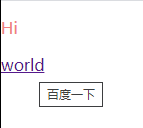

# HTML

## `Web`概述

1984年伯纳斯李创造了万维网：

* 第一个客户端浏览器（`World Wide Web`）
* 第一个`Web`服务器`httpd`(超文本传输协议守护进程)

### `Web`的特点

* 易导航和图形化界面
* 与平台无关性
* 分布式结构
* 动态性
* 交互性

### 网页（`web page`）

网页主要是由文字、图像、音频、视频和超链接等元素构成

* [世界上的第一个网站](http://info.cern.ch/hypertext/WWW/TheProject.html)

### 网站(`web site`)

互联网上用于展示特定内容的相关网页的集合。而一个网站中网页通过网页中的超链接的方式组合在一起

其中的第一个网页成为主页（`homepage`），也就是进入网站后看到的第一个网页，主页的文件名通常为`index.html`

### `Web`服务器


### `Web`工作原理


### `URL`统一资源定位符

`URL`，`Uniform Resource Locator`，统一资源定位符，类比于门牌号

`URL`由协议、主机域名及路径和文件名三个部分组成

> 协议类型：//服务器地址（端口号）/路径/文件名

* 协议类型：服务类型

  | 协议类型 |            说明            |
  | :------: | :------------------------: |
  |  `http`  |       超文本传输协议       |
  | `https`  | 用加密传送的超文本传输协议 |
  |  `ftp`   |        文件传输协议        |
  |  `file`  | 本地计算机或网上分享的文件 |

## 浏览器

浏览器是用于网页显示、运行的平台；前端开发中的核心工具，编写的所有代码只有通过浏览器的渲染成可供用户查看的页面，也就说所有代码最后形成实际效果是由浏览器来决定的

五大浏览器有：

* 谷歌浏览器
* 火狐浏览器
* IE浏览器
* Safari浏览器
* Edge浏览器
* Opera浏览器


相较于其他浏览器优势在于：

* 解析CSS、JS的速度快；
* 支持多种新功能；
* 插件化开发，可按照需求定制个性化的浏览器；

### 浏览器内核

浏览器内核可以分为两部分：

* **渲染引擎**（`Layout Engineer`或者`Rendering Engine`）
* **`JS`引擎**

#### 渲染引擎

渲染引擎的作用就是负责取得网页内容（HTML、图像等），计算网页的显示方式，然后在显示器上显示

浏览器不同的内核对于网页的语法解释会有不同，所以渲染的效果也就不同

#### `JS`引擎

`JS`引擎用于解析`JavaScript`语言，执行`JavaScript`语言来实现网页的动态效果

#### 常见浏览器内核分类

常见的浏览器内核可以分为以下四种：

* `Trident`

  IE内核，以及国内的双核浏览器兼容模式：

  * IE、360极速浏览器、百度浏览器等都是以其为内核
  * Window10发布后，IE将其内置浏览器命名为Edge，而Edge最显著的特点就是新内核EdgeHTML

* `Gecko`

  Firefox内核，Mozilla FireFox：

  * 代码是完全公开的

* `Webkit`

  苹果浏览器Safari的内核：

  * Apple Safari、Android默认浏览器

* `Blink`

  在Chromium项目中研发出来的Blink渲染引擎，内置在了Chrome浏览器之中：

  * Blink其实是Webkit的分支
  * 大部分国产浏览器最新版都是采用Blink内核，而采用的二次开发

## Web标准

由于浏览器的内核不同，所以会导致同一个代码所生成网页显示的效果是不一样的，会有很多的差别，此时最好的解决方法就是需要一个标准将其统一化，也就是说使不同浏览器展示出的内容得到统一，也就是标准

### 万维网联盟（W3C）

万维网联盟（`World Wid Consortium`，`W3C`），是万维网的主要国际标准组织：

* 1994年伯纳斯李创建了万维网联盟（W3C）
* 该组织制定了W3C规范一套标准用以解决网络应用在不同平台间的兼容问题
* 定义了网页中的`HTML`、`CSS`、`DOM`等的标准

### Web标准构成

Web标准是由W3C和其他的标准化组织指定的一系列标准的集合，主要包括三个方面：

* **结构（Structure）**：HTML用于描述页面的结构，使内容更加清晰，更有逻辑性
* **表现（Presentation）**：CSS用于控制页面中元素的样式，修饰内容的样式，美化页面
* **行为（Behavior）**：JavaScript用于响应用户操作，控制内容的交互以及操作效果，负责页面的行为

举例：

* 房子
* 人

所以最理想的源码状态是：一个优秀的网页会要求结构、表现、行为三者分离：

* `.html`文件
* `.css`文件
* `.js`文件

也可理解为：**解耦**

解耦：代码之间的关系过于紧密，修改一个必须要同时对其他部分进行修改，也就是牵一发而动全身

### Web标准的优势

Web标准的优势是呼之欲出的：

* 使网站更容易维护
* 使网页能让更多更广泛的设备访问


## HTML

**超文本标记语言**（Hyper Text Markup Language，HTML）：

* **超文本**：

  与普通文本的区别在于它可以在其中假如图片、声音、动画、多媒体、超级链接等内容，其中的超级链接还可以使其从一个文件跳转到另一个文件

* **标记**：

  HTML中的标记指的就是标签，作用是用于描述网页，结构：

  ```html
  <标签名>标签内容</标签名>
  <标签名 />
  ```

**需要注意的是：**

* HTML不是一种编程语言，而是一种标记语言
* 标记语言是一套标记标签
* 一个完整的标签也称为元素
* HTML文件：普通文件+HTML标记

### HTML发展历史

* 1993年6月：HTML第一个版本发布
* 1995年11月：HTML2.0
* 1997年1月：HTML3.2（W3C推荐）
* 1999年12月：HTML4.01（W3C推荐）
* 2000年底：XHTML1.0（W3C推荐）
* 2014年10月：HTML5（W3C推荐）

#### `XHTML`

当`HTML`发展到一个极度混乱的程度时，`W3C`组织制定了`XHTML`，目的是为了逐步取代原有的`HTML`，也就是说`XHTML`成为了那个时候最新的`HTML`规范

`XHTML`，`eXtensible Hyper Text Markup Language`，扩展的超文本标记语言，它是更严格、更纯净的`HTML`代码

**`XHTML`要求`HTML`文档首先必须是一份`XML`文档**

`XML`文档是一种结构化文档，满足以下4种条件：

* 整个文档有且仅有一个根元素
* 每个元素都由开始标签和结束标签组成
* 元素与元素之间应该合理的嵌套
* 元素的属性必须有属性值，并且属性值必须用引号包裹起来

#### `DTD`

`DTD`（`Document Type Definition`），文档类型定义，用来定义`HTML`和`XHTML`的语义约束

其包括`HTML`文档可以出现哪些元素，各元素支持哪些属性

[DTD](http://www.w3.org/TR/html401/loose.dtd)

示例：以下为片段，定义了`BODY`元素支持的哪些属性等


**实际上，很少有`HTML`页面能够完全的遵守`XHTML`规范**，尴尬的局面下妥协式的规范`HTML5`应运而生

`HTML5`规范十分的宽松，甚至都不再提供`DTD`

为了验证网页是否符合规范，`W3C`提供了一个在线验证页面：

[在线验证](http://validator.w3.org/)

#### `HTML5`

`HTML5`的优势：

* 解决跨浏览器的问题
* 更加明确的语义支持
* 新增的部分标签属性可替代`JavaScript`

### 骨架格式

HTML的语言骨架格式：

```html
<!DOCTYPE html>
<html>
<head>
	<meta charset="UTF-8">
	<title>网页标题</title>
</head>
<body>
	<h1>网页正文</h1>
</body>
</html>
```

#### 文档类型`<!DOCTYPE>`

`Document Type`，文档声明，该不属于HTML标签

* 作用：用于告诉浏览器该HTML文件使用的是HTML中的哪一个版本，也就是开始声明文档类型定义（`DTD`）

* 位置：文档最开始的位置

* 语法：

  ```html
  <!DOCTYPE element-name DTD-type DTD-name DTD-url>
  ```

  * `element-name`：指定该`DTD`的根元素名称
  * `DTD-type`：指定该`DTD`类型：
    * `PUBLIC`：表示该`DTD`是标准公用的
    * `SYSTEM`：表示私人指定的
  * `DTD-name`：指定该`DTD`的文件名称
  * `DTD-url`：指定该`DTD`文件所在的`URL`地址

* 规范：

  * **html5**：html:5

    ```html
    <!DOCTYPE html>
    ```
    
  * xhtml1.0：
  
    ```html
    <!DOCTYPE html PUBLIC "-//W3C//DTD XHTML 1.0 Transitional//EN" "
    http://www.w3.org/TR/xhtml1/DTD/xhtml1-transitional.dtd">
    
    <!DOCTYPE html PUBLIC "-//W3C//DTD XHTML 1.0 Strict//EN" 
    "http://www.w3.org/TR/xhtml1/DTD/xhtml1-strict.dtd">
    
    <!DOCTYPE html PUBLIC "-//W3C//DTD XHTML 1.0 Frameset//EN" 
    "http://www.w3.org/TR/xhtml1/DTD/xhtml1-frameset.dtd">
    
    ```

需要注意：

* 不加文档类型声明：浏览器为混杂模式
* 添加文档声明：浏览器为标准模式

#### `<meta>`标签

* 提供有关页面的元信息，比如：针对搜索引擎的网页描述或关键词等

* `<meta>`标签位于文档的头部，其中不包含任何内容

* `<meta>`标签的属性定义了与文档相关联的键值对：

  * `name`：需要设置的数据的名字
  * `content`：需要设置的数据的值
  * `http-equiv`：用于设置Http协议的响应头

* 常用功能：

  * 设置网页的描述信息

    ```html
    <meta name="description" content="这是一个学习使人快乐的网站...">
    ```

  * 设置网页的关键字

    ```html
    <meta name="keywords" content="HTML,CSS,JavaScript">
    ```

  * 设置网页的重定向

    ```html
    <meta http-equiv="refresh" content="4;url=https://www.baidu.com">
    ```

* `<meta charset="UTF-8">`：

  用于告诉浏览器使用哪一种字符集来解析文件，即使用`utf-8`字符集来解析文件
  
  * 说明该页面内容所用的字符集的常用方法：
  
    ```html
    <!-- 第一种方法 -->
    <meta http-equiv="content-type" content="text/html; charset=utf-8">
    <!-- 第二种方法 -->
    <meta charset="UTF-8">
    ```
  
* `name`属性：

|      值       |      说明      |
| :-----------: | :------------: |
|   `author`    |  定义网页作者  |
| `description` |  定义网页简介  |
|  `keywords`   | 定义网页关键词 |
|  `generator`  |   定义编辑器   |

* `http-equiv`属性：

  |       值       |       说明       |
  | :------------: | :--------------: |
  | `content-type` |     内容类型     |
  |   `refresh`    |    重定向页面    |
  |   `expires`    | 网页缓存过期时间 |
  |  `set-cookie`  |      cookie      |

#### 字符集

##### 编码

计算机底层中所有的数据都是以二进制的形式保存的，而我们所创建的文本文件最终也需要存储到磁盘中：


##### 解码

当我们读取文件时，又需要将二进制数据转换成为字符：


##### 常见字符集

解码和编码所采用的规则就为字符集（`charset`）

常见字符集：

* `ASCII`：数字、英文字母、符号
* `GBK`：收录了大陆汉字，同时添加了港澳台的文字

* `UTF-8`：所有语言，占用空间少

##### 出现乱码的原因

编码和解码时所用的字符集不同

例如：

* `utf-8`：1个汉字 = 3个字节
* `GBK`：1个汉字 = 2个字节


### 标签（tag）

标签是尖括号内包含关键词，用以告诉浏览器该如何显示页面，不同的HTML标签能显示不同的效果

HTML文档结构主要由若干标签构成

#### `SEO`

`SEO`：Search Engine Optimization，搜索引擎优化

* 作用：用来优化网站使得网站在搜索引擎上的排名靠前，进而有更多的用户可以访问到该网站
* 如何提高网站的SEO：
  * 花钱，效果最快速直接
  * 将页面做成静态页面（后缀名为`.html`）
  * 外链，作用类似于广告
  * 标签语义化（语义化规范）

#### 标签语义化

标签语义化，在合适的位置使用合适的标签，可以理解为，文件中去除样式表现、行为等内容后，仍能够较为清晰的理解各个部分的作用。

每个标签都有属于自己的语义

使用它的优势：

* 利于代码的阅读与理解
* 便于代码维护
* 更好的搜索引擎优化
* 有利于其他设备的读取

**原则：**

先确定语义的HTML，再选择合适的CSS，也就是说去掉CSS之后，网页结构依然具有可读性，能够很清楚的看懂各个部分是什么作用，依然组织有序

#### 标签分类

* 双标签

  ```html
  <标签名>内容</标签名>
  ```

  语法中：`<标签名>`表示该标签的作用开始，称为开始标签（start tag），`</标签名>`表示该标签的作用结束，称为结束标签（end tag）

  > 标题：<title>网页标题</title>

* 单标签

  ```html
  <标签名 />
  <标签名>
  ```
```
  
单标签也被称为空标签，用一个标签符号即可完整的描述标签功能
  
  > 换行：<br />

注意：HTML5中标签不区分大小写：

​```html
<head></head>
<HEAD></HEAD>
```

以上两者等效

#### 标签关系

* 嵌套关系

  ```html
  <head>
  	<meta charset="UTF-8">
  	<title>网页标题</title>
  </head>
  ```

  此时`<head>`标签被称为`<meta>`标签和`<title>`标签的父标签、父元素，而`<meta>`标签和`<title>`标签又被称为`<head>`标签的子标签、子元素

  ```html
  <body>
  	<p><em>内容</em></p>
  </body>
  ```

  此处的`<body>`标签也称作`<p>`标签和`<em>`标签的祖先元素，而`<p>`标签和`<em>`标签也称作`<body>`标签的后代元素

  **注意：标记是可以相互嵌套，但不能交叉**

  ```html
  <body><p>这就是错误的交叉嵌套</body></p>
  ```

* 并列关系

  ```html
  <meta charset="UTF-8">
  <title>网页标题</title>
  ```

  此处，`<meta>`标签和`<title>`标签的关系就为并列关系，也就是兄弟关系

#### 标签属性

* 修饰标签，通过属性为HTML元素提供附加信息，可以使同一标签显示出不一样的效果
* 属性应在开始标记内定义，且标签名与属性名之间必须以空格隔开
* 属性与属性之间没有任何顺序关系
* 属性一般是以“名称/值”对的形式出现：`属性名="属性值"`，其中双引号可以省略，效果一致，但是建议最好是用双引号包裹起来
* 每种标签的属性并不是完全一样的，有一些属性对于某种标签是存在可用的，但对于其他的标签是没有作用的
* 尽量不要使用样式属性
* 部分属性是任意值，部分是指定值
* 当属性值为`boolean`值时，可以省去属性值的`true`或`false`，当属性值为`true`时，直接写入属性名称即可，当为`false`时，不写属性名称即可
* 当属性等于属性值时，可以简写属性

```html
<标记名称 属性名1="属性值1" 属性名2="属性值2" 属性3="属性值3" ... 属性名n="属性值n"></标记名称>
```

##### 通用属性

一些属性是所有元素都支持的

###### `id`属性

`id`属性用于为HTML元素指定**唯一标识**，类似于身份证，所以同一个网页中不能出现相同的`id`属性值

###### `class`属性

为标签分组，拥有相同`class`属性的标签可被认为是一组，用于匹配CSS样式，所以同一网页中可以出现相同的`class`属性值

###### `style`属性

用于为HTML元素指定CSS样式

###### `title`属性

用于指定标签的标题，为HTML元素指定额外信息，设置`title`属性值后，鼠标悬停到元素上方后，就会出现该属性值所包含的文本内容

经常与`<a>`元素一起使用

```html
<!-- 通用属性 -->
<div id="general_attri" >
  <p class="red" style="color:lightcoral">Hi</p>
  <a href="https://www.baidu.com/" title="百度一下">world</a>
</div>
```



###### `tabindex`属性

当用户浏览网页时，可以不使用鼠标而直接通过键盘上的`Tab`按键进行切换窗口或`HTML`元素来获得焦点，该属性的值就是用来设置获取焦点或者控制窗口的顺序：

```html
<!-- tabindex属性 -->
<div>
  <a href="#" tabindex="2">CSS</a>
  <a href="#" tabindex="1">HTML</a>
  <a href="#" tabindex="3">JavaScript</a>
  <span tabindex="4">学习什么好呢</span>
  <input type="text" name="skill" id="skill" tabindex="5">
</div>
```


需要注意的是：该属性对于有交互作用的元素标签作用很明显，例如：`<input>`、`<a>`、`<button>`、`<textarea>`等元素，同时为了避免其他元素的干扰，可以将其设置为`tabindex=-1`

```html
<span tabindex="-1">学习什么好呢</span>
```

#### 基本标签

##### `<!-- -->`标签

* 作用：
  * 定义`HTML`注释
  * 被其包裹的文本内容会被当做注释处理掉
  * 注释之间不能相互嵌套
  * 注释不会被浏览器解析

##### `<html>`标签

* 作用：
  * 用于告诉浏览器之个文档中包含的信息是用HTML编写的
  * 所有HTML标签中的一个根节点、根标签，也就是最大的标签
* 用法：
  * 一个页面中`<html>`标签只能有一个
  
  * 网页中的所有内容都需要编写在`<html>`标签之中
  
  * `<html>`标签中包含两个子标签`<head>`和`<body>`
  
  * `lang`属性：用于设置当前页面的语言
  
    ```html
    <html lang="en">
    
    </html>
    ```
  
    * `en`：表示告诉浏览器页面使用的主要是英文
    * `zh`：表示告诉浏览器页面所使用的主要是中文

##### `<head>`标签

* 作用：
  * 用来表示网页的头部分，用于描述文档的各种属性和信息等
  * 包括：文档的标题、与其他文档之间的关系等
  * 其中包含了浏览器和搜索引擎使用的其他不可见信息，即不会显示在网页之中
  
* 用法：
  * 一个网页中只能有一个`<head>`标签
  * `<head>`标签中必须要设置的是标签`<title>`
  
* 示例：

  ```html
  <head>
    <meta charset="UTF-8">
    <meta http-equiv="X-UA-Compatible" content="IE=edge">
    <meta name="viewport" content="width=device-width, initial-scale=1.0">
    <title>测试</title>
  </head>
  ```

##### `<title>`标签

* 作用：

  * 用于设置网页的标题，会在网页的标题栏中显示

* 用法：

  * 一个网站中的多个页面的title不应该重复，重复不利于搜索引擎的检索
  * `<title>`标签需要紧跟在`<head>`标签内，便于搜索引擎检索

* 示例：

  ```html
  <head>
    <meta charset="UTF-8">
    <title>常用标签</title>
  </head>
  ```
  
  

##### `<body>`标签

* 作用：
  * 用来设置网页的主体，也就是说主题内容被包含在`<body></body>`标签之间
  * 所有在页面中能看到的内容都应该编写到`<body>`标签中
* 用法：
  * `<body>`标签作为`<html>`标签的子标签使用

##### `<h1>`~`<h6>`标签

* heading，头部、标题

* 作用：
  * 标题标签，给页面上的文字加上标题语义,用于表示网页中的一个标题，也就相当于正文的标题
  * 其重要性仅次于页面的`title`

* 用法：
  * `<h1>`-`<h6>`重要性越来越低
  * 一般只会使用到标签`<h3>`，因为`<h3>`标签以后的标题标签对于搜索引擎就没有什么意义了
  * 一个页面最好只使用一个`<h1>`标签，原因：`<h1>`尽量少用，太多了并不利于SEO(搜索引擎优化)，一般来说`<h1>`都是给文章的标题或者logo使用

* 示例：

```html
<!DOCTYPE html>
<html lang="en">
<head>
  <meta charset="UTF-8">
  <meta name="viewport" content="width=device-width, initial-scale=1.0">
  <title>常用标签</title>
</head>
<body>
  <h1>标题标签</h1>
  <h2>标题标签</h2>
  <h3>标题标签</h3>
  <h4>标题标签</h4>
  <h5>标题标签</h5>
  <h6>标题标签</h6>
</body>
</html>
```


##### `<p>`标签

* paragraph，段落

* 作用：

  * 表示网页中的一个段落
  * 页面上的一个段落会独占一行，并且段落与段落之间会存在距离

* 用法：

  * 浏览器会在段落的前和后各加上一个换行，也就是段落会在页面中自成一行

* 属性：

  * `align`：对齐方式
    * `left`：左对齐
    * `center`：居中对齐
    * `right`：右对齐
    * `justify`：两端对齐

* 示例：

  ```html
  <body>
    <!-- p标签 -->
    <p>Lorem ipsum dolor sit amet consectetur adipisicing elit.</p>
    <p>Soluta libero nesciunt, </p>
    <p>repellat porro ducimus possimus voluptatum cupiditate</p> 
    <p>molestias dolores deserunt vel eos cum aspernatur magnam nulla!</p> 
    <p>incidunt consequatur?</p>
  </body>
  ```

  

##### `<div>`标签

* division，分割、分区

* 作用：

  * 表示页面中一个布局容器
  * 没有任何语义
  * 标签中可包含各种内容，但`<div>`标签的滥用会导致网页中语义的清晰度下降，可读性变差
  * 显示效果：独占一行

* 用法：

  ```html
  <div>
      内容
  </div>
  ```

##### `<span>`标签

* span，跨度、范围

* 作用：

  * 用于选中内容，可以方便我们设置其样式
  * 没有任何语义
  * 不会独占一行，会被包裹的文本内容撑开

* 用法：

  ```html
  <span>文字内容</span>
  ```

##### `<div>`、`<span>`与`<p>`三者标签的区别


* `<span>`标签不会导致换行
* `<div>`标签会导致换行
* `<p>`标签会产生一个段落，而段落与段落之间默认会有更大的间距

##### `<br>`标签

* break，打断、换行

* 作用：

  * 将文本强制换行显示

* 用法：

  ```html
  <br />
  ```

##### `<hr>`标签

* horizontal Rule：horizontal  水平线、横线

* 作用：

  * 使用一条水平线将段落与段落之间隔开

* 用法：

  ```html
  <hr />
  ```

* 属性：
  * `width`：设置水平线宽度
  * `size`：设置水平线高度
  * `color`：设置水平线颜色
  * `align`：设置水平线对齐方式

```html
<!-- hr标签 -->
<hr width="200px" size="10px" color="lightgreen" align="center" />
<hr width="100px" size="2px" color="pink" align="left" />
```


**小应用：新闻页面**


#### 文本格式化标签

文本格式化元素能包含文本、图像、超链接、文本格式化元素和表单控件元素等，也可以与`<span>`元素相互包含

**推荐使用：具有语义的标签**

##### `<b>`标签

* 作用：

  * 定义粗体标签，使包含文字粗体显示
  * 并不具备强调的语义

* 示例：

  ```html
  <span><b>b标签：加粗文本</b></span><br>
  ```

##### `<strong>`标签

* 作用：

  * 定义粗体标签，使包含文字粗体显示
  * 具有强调的语义，着重文字

* 示例：

  ```html
  <span><strong>strong标签：加粗文本</strong></span><br>
  ```

##### `<i>`标签

* 作用：

  * 定义斜体文本
  * 没有强调的语义

* 示例：

  ```html
  <span><i>i标签：斜体文本</i></span><br>
  ```

##### `<em>`标签

* 作用：

  * 定义斜体文本
  * 具有强调的语义，加重语气

* 示例：

  ```html
  <span><em>em标签：斜体文本</em></span><br>
  ```

##### `<small>`标签

* 作用：

  * 定义小号字体文本

* 示例：

  ```html
  <span>文本<small>small标签：小号字体文本</small></span><br>
  ```

##### `<sup>`标签

* 作用：

  * 定义上标文本

* 示例：

  ```html
  <span>文本<sup>sup标签：上标文本</sup></span><br>
  ```

##### `<sub>`标签

* 作用：

  * 定义下标文本

* 示例：

  ```html
  <span>文本<sub>sub标签：下标文本</sub></span><br>
  ```

##### `<bdo>`标签

* 作用：

  * 属性`dir="ltr"`：将指定文本从左向右显示
  * 属性`dir="rtl"`：将指定文本从右向左显示

* 示例：

  ```html
  <!-- 文本显示方向 -->
  <span>文本显示：<bdo dir="ltr">从左向右显示文本</bdo></span><br>
  <span>文本显示：<bdo dir="rtl">从右向左显示文本</bdo></span><br>
  ```


#### 特殊字符标签

特殊字符对应的代码：

| 显示结果 |  符号代码  |     说明     |
| :------: | :--------: | :----------: |
|          |  `&nbsp;`  | 显示一个空格 |
|   `<`    |   `&lt;`   |     小于     |
|   `>`    |   `&gt;`   |     大于     |
|   `&`    |  `&amp;`   |    &符号     |
|   `"`    |  `&quot;`  |    双引号    |
|   `©`    |  `&copy;`  |     版权     |
|   `®`    |  `&reg;`   |   注册商标   |
|   `×`    | `&times;`  |     乘号     |
|   `÷`    | `&divide;` |     除号     |

现象：


发现此时需要输入的多个空格在显示时只会显示一个空格


内容中包含回车时，显示只会有一个空格代替

以上的这些现象就可以使用特殊字符标签来解决：


#### 语义标签

##### `<q>`标签

* 作用：

  * 定义一个较短的、不带换行的引用文本
  * 浏览器会为这段被引用的文本添加引号

* 示例：

  ```html
  <p>学习的指导思想：<q>学习使我快乐</q>这是一种态度</p>
  ```


##### `<blockquote>`标签

* 作用：

  * 定义一个段长的引用文本

* 用法：

  * `cite`属性：用于指定该引用文本所引用的网址URL或出处

* 示例：

  ```html
  <blockquote cite="定风波·莫听穿林打叶声">
    莫听穿林打叶声，何妨吟啸且徐行。<br>
    竹杖芒鞋轻胜马，谁怕？一蓑烟雨任平生。<br>
    料峭春风吹酒醒，微冷，山头斜照却相迎。<br>
    回首向来萧瑟处，归去，也无风雨也无晴。<br>
  </blockquote>
  ```


##### `<pre>`标签

* 作用：

  * 表示该元素所包含文本已经进行了预格式化
  * 标签内部的空格、回车、Tab键和其他格式字符都会保留下来

* 示例：

  ```html
  <pre>
    莫听穿林打叶声，何妨吟啸且徐行。
    竹杖芒鞋轻胜马，谁怕？一蓑烟雨任平生。
    料峭春风吹酒醒，微冷，山头斜照却相迎。
    回首向来萧瑟处，归去，也无风雨也无晴。 
  </pre>
  ```


##### `<cite>`标签

* 作用：

  * 用于表示作品（书籍、音乐和电影的名称）的标题
  * 浏览器会用斜体字来显示所包含的文本

* 示例

  ```html
  <p>
    <cite>JavaScript高级程序设计</cite>和<cite>你不知道的JavaScript</cite>都是很好的书哦！
  </p>
  ```


##### `<abbr>`标签

* 作用：

  * 用于表示一个缩写

* 用法：

  * `title`属性用于指定该缩写所表示的全称，也是该标签的必须属性

* 示例：

  ```html
  <p>一月（元月）：<abbr title="January">Jan</abbr></p>
  ```


##### `<address>`标签

* 作用：

  * 用于表示一个地址
  * 浏览器会使用斜体字来显示所包含的文本

* 示例：

  ```html
  <p>福尔摩斯：<address>伦敦贝克街221号</address></p>
  ```


##### `<code>`标签

* 作用：

  * 用于表示这是一段计算机代码

* 示例：

  ```html
  <code>
    var name = 'Snoopy';<br>
    console.log('Hi,',name)
  </code>
  ```


##### `<dfn>`标签

* 作用：

  * 用于定义一个专业术语
  * 浏览器会用粗体或斜体字显示标签内所包含的文本

* 示例：

  ```html
  <p>史努比原型为<dfn>米格鲁猎兔犬</dfn></p>
  ```


##### `<del>`标签

* 作用：

  * 定义文档中被删除的文本
  * 浏览器会以中划线的形式显示所包含的文本

* 用法：

  * `cite`属性：属性值为一个`URL`，该`URL`对应的文本解释了文本被删除的原因
  * `datetime`属性：定义文本被删除的日期时间

* 示例：

  ```html
  <p>哆啦A梦是<del datetime="2021-02-11 10:42:43" cite="https://baike.baidu.com/item/%E5%93%86%E5%95%A6A%E6%A2%A6/185384?fr=aladdin">大熊猫</del></p>
  ```

  

##### `<ins>`标签

* 作用：

  * 定义文档中插入的文本
  * 浏览器会以下划线的形式显示所包含的文本

* 用法：

  * `cite`属性：属性值为一个URL，该URL对应的文本解释了文本被插入的原因
  * `datetime`属性：定义文本被插入的日期时间

* 示例：

  ```html
  <p>哆啦A梦是<ins datetime="2021-02-11 10:42:43" cite="https://baike.baidu.com/item/%E5%93%86%E5%95%A6A%E6%A2%A6/185384?fr=aladdin">大熊的猫</ins></p>
  ```

  

##### `<kbd>`标签

* 作用：

  * 用于定义键盘文本
  * 用于表示文本是通过键盘输入的

* 示例：

  ```html
  <kbd>list -l</kbd>
  ```


##### `<var>`标签

* 作用：

  * 用于表示所包含文本为变量
  * 浏览器会用斜体字显示所包含的文本

* 示例：

  ```html
  <p><var>i</var> 和 <var>j</var> 是两个变量</p>
  ```

  

##### `<ruby>`标签

该标签用于为一个或多个段誉定义`ruby`注释，`ruby`注释的通用形式是在短语后面紧跟一段注释文字，用于说明该短语的发音或者其他的注释

###### `<rb>`标签

用于定义该`ruby`注释所解释的短语

###### `<rt>`标签

该标签内定义`ruby`注释的说明部分

###### `<rp>`标签

该元素用于为不支持`ruby`注释提供备用文本

注意：建议使用该元素标注`ruby`注释的文本内容两边的圆括号，对于支持`ruby`注释的浏览器不会将`<rp>`标签内包含的内容显示出来

```html
<ruby>
	饕
	<rb>餮</rb>
	<rp> (</rp>
	<rt>tāo</rt>
	<rt>tiè</rt>
	<rp>) </rp>
</ruby>
```


#### 外部资源标签

##### 路径

外部资源标签都会涉及到一个访问外部资源路径的问题

路径又可分为：

* 绝对路径
* 相对路径

###### 绝对路径

带有盘符的路径，例如

> D:\Notes\codes\images

由于其会导致可移植性较差，所以使用较少

也包含网址`URL`

###### 相对路径

其可移植性较好，所以较为常用，有：

* **同级目录**
* **下级目录**
* **上级目录**

##### ``标签

* 作用：

  * 使用该标签在页面中定义图片

* 属性：

  * `src`：使用该元素必须指定该属性，用于指定图片文件的所在位置，可以使用相对路径也可以使用绝对路径

    ```html
    <!-- 图片img元素 -->
      
    ```

    * 当页面与图片是同一级目录，则可以直接写目标文件的名字即可
    * 如果图片文件的位置是与页面的同级目录文件夹下，则路径名要包含该目录名称
    * 如果图片在页面的上一级目录下，则应该先去上级目录（`../`）

  * `alt`：该属性的值为图片的描述，具体为当图片在网页中不能正常显示时会作为该图片的提示信息，可用于搜索引擎的优化

    ```html
    
    
    ```

    

  * `title`：设置当鼠标悬停在图片上所显示的文本内容

    ```html
    
    ```

    

  * `width`：指定该图片显示的宽度，属性值可以是百分比，也可以是像素值

  * `height`：指定该图片显示的高度，属性值可以是百分比，也可以是像素值

* 相关用法：

  * 该元素只能是一个空元素，不可以包含任何内容

  * 可以提交图片的点击坐标：`ismap`属性
  
    ```html
 <a href="#"></a>
    ```
    
    
  
  * 创建分区链接图片：
  
    * `<map>`元素：用于定义图片映射，该元素可以包含一个或多个`<area>`元素
    * `<area>`元素：使用图片映射的内部区域，每个`<area>`元素定义一个区域，不同区域可以连接到不同的`URL`，该元素的属性`shape`可以指定该内部区域的形状，该属性默认值为`rect`，即为矩形区域，除此之外还有圆形区域（`circle`）和多边区域（`ploy`），`coords`属性值用于确定区域位置
  
    ```html
    <!-- img标签：创建分区链接图片 -->
    
    <!-- 定义图片的映射 -->
    <map name="test" id="test">
      <area shape="circle" coords="57,55,25" href="https://www.baidu.com/" alt="circle" title="circle">
    </map>
    ```
  
    
  
  * 在图片上添加链接：
  
    ```html
    <a href="https://www.baidu.com/"></a>
    ```
  
    

###### 常见的图片格式

* `GIF`：支持动图
* `JPG`：不支持动画、不支持透明度，支持颜色较为丰富的图片，有损压缩
* `PNG`：支持透明度，无损压缩，相较图片大小大一些
* `webp`：谷歌最新的图片压缩格式，支持动图，支持透明度，文件体积相较更小
* `BMP`：不常用

##### `<iframe>`标签

* 作用：

  * 用来引入一个外部的网页
  * 先已很少使用，且不推荐使用

* 属性：

  * `width`：设置该iframe的宽度

  * `height`：设置该iframe的高度

  * `frameborder`：设置是否显示该iframe的表框

  * `src`：该属性指定一个`URL`，指定该iframe将装载哪一个页面

    ```html
    <iframe src="https://www.baidu.com/" frameborder="8" height="420" width="420"></iframe>
    ```

    

  * `scrolling`：用于设置该iframe是否显示滚动条，支持三个属性值：

    * `yes`：显示滚动

    * `auto`：自动，该iframe大小不够显示时显示滚动条，否则不显示滚动条

    * `no`：不显示滚动条，无论该iframe够不够显示

      ```html
      <iframe src="https://www.baidu.com/" frameborder="8" height="420" width="420" scrolling="no"></iframe>
      ```

      

  * `srcdoc`：HTML5新增属性，允许直接使用HTML片段，但如果浏览器不支持该属性(例如：IE浏览器不支持该属性)，那么就会继续显示`src`属性所指定的页面内容

    ```html
    <iframe src="https://www.baidu.com/" frameborder="8" height="420" width="420" srcdoc="<h1>HTML5</h1><div>HTML5是标记语言</div>"></iframe>
    ```

    


#### 多媒体标签

在HTML5之前，如果需要在网页中插入播放视频、音频，通常需要借助第三方的插件，如Flash，而HTML5新增的标签解决了这个局面，使得浏览器无需安装额外插件，浏览器本身提供支持

##### `<audio>`标签

* 作用：

  * 向页面中引入一个外部的音频

* 参数：

  * `src`：指定播放音频的URL地址
  * `controls`：播放音频时是否显示控制条，属性值为`boolean`值，值为`true`时，就显示控制条
  * `autoplay`：是否在音频转载完成后自动播放，属性值为`boolean`值，值为`true`时，就自动播放
  * `loop`：是否设置为循环播放，属性值为`boolean`值，值为`true`时，就为循环播放

* 示例：

  ```html
  <audio src="../src/audio.mp3" controls autoplay loop></audio>
  ```

##### `<video>`标签

* 

* 示例：

  ```html
  <video src="../src/flower.mp4" controls autoplay loop></video>
  ```

  

#### 超链接

##### `<a>`标签

* anchor，锚、铁锚

* 作用：

  * 通过该标签，可以快速跳转到其他页面或者跳转到其他指定位置

* 用法：

  * `<a>`标签内必须写入内容，否则在页面中是看不到该元素的
  * `<a>`标签之间是不能嵌套的
  * 未点击过的链接默认文本字体显示为蓝色，当连接点击后，默认颜色显示为紫色
  * `<a>`标签内可以包含文本、图像、表单元素和各种文本格式化元素

* 属性：
  * `href`：值为一个链接地址，即`<a>`标签跳转的目标地址
    * 外部链接，需要添加`https://`，此处为一个绝对网址，该属性值为`URL`
    
    * 内部链接直接写入所链接页面的路径即可，也就是说可以只为一个文件名，此时该文件名就会被当成相对路径，浏览器会在该页面的基准路径上加上该文件名
  
    * `href`属性值既可以是绝对路径，也可以是相对路径
    
    * 当项目中没有确定的链接目标时，通常将属性`href`的属性值设置为`#`，表示其暂时为一个空链接
    
    * 当属性`href`的属性值为空时，点击时会刷新页面
    
      ```html
      <a href="">空链接</a>
      ```
    
  * `target`：值可选择：`_blank`、`_self`
    * `_blank`：保留原始页面，打开新窗口再进行跳转
    * `_self`：在当前页面进行跳转
  * `download`：用于让用户下载目标链接所指向的资源，而并不是直接打开该目标链接，该属性的属性值为指定用户用于保存该下载资源的默认文件名
  * `type`：指定被链接文档的`MIME`文档
  * `media`：指定目标`URL`所引用的媒体类型，默认值为`all`，只有在指定了`href`属性才有效
  
* 相关标签：`<base>`：

  * 作用：可以为页面中所有的超链接`<a>`标签统一跳转方式

  * 位置：放在`<head>`标签内，`<title>`标签之下

  * 示例：

    ```html
    <base target="_blank">
    ```

###### `<a>`标签的其他用法

* **不跳转，直接进行文件下载**

  当路径指向的目标文件是浏览器打不开的文件时，浏览器就会默认做下载处理，不常用也不推荐是用这个用法

  ```html
  <a href="../bear.zip" download="download_bear.zip">下载文件</a>
  ```

  

* **不跳转新页面，只跳转到到本页面的某个位置**

  * 跳转到块级元素：使用指定位置元素的`id`属性进行定位

  ```html
  <a href="#daxiong">大雄的猫</a>
  ```

  * 跳转到`<a>`元素：

    可以使用指定跳转到的`<a>`元素的`id`属性，用法与跳转块级元素相同

    也可以使用`name`属性：

    ```html
    <a href="http://www.baidu.com" name="here">到我</a>
    <br><br><br><br><br><br><br><br><br><br><br><br><br><br><br><br><br><br><br><br><br><br><br><br><br><br><br><br><br><br><br><br><br><br><br><br><br><br><br><br><br><br><br><br><br><br><br><br><br><br>
    <a href="#here">点击</a>
    ```

    

* **跳转到新页面的特定位置**

  将指定的`URL`和需跳转位置元素的`id`属性值结合

  ```html
  <a href="./超链接本页面.html#daxiong">大熊的猫</a>
  ```

#### 列表元素

##### 无序列表`<ul>`标签

* `ul`：`Unordered List`

* 作用：

  * 用于显示一组没有任何排列顺序的数据

* 用法：

  * 无序列表中的数据没有任何先后顺序之分
  * `<ul>`标签中只能嵌套`<li>`标签，不能嵌套其他的标签元素或者文字
  * `<li>`标签中可以嵌套任意标签

* 属性：

  * `type`：
    * `disc`：实心圆形
    * `circle`：空心圆形
    * `square`：实心正方形

* 示例：

  ```html
  <!-- 无序列表 -->
  <ul>
    <li><a href="#">家电</a></li>
    <li><a href="#">食品</a></li>
    <li><a href="#">图书</a></li>
    <li><a href="#">玩具</a></li>
    <li><a href="#">文具</a></li>
    <li><a href="#">药品</a></li>
  </ul>
  ```


##### 有序列表`<ol>`标签

* 作用：
  
  * 用于显示一组有顺序的列表
  
* 用法：

  * `<ol>`标签中只能嵌套`<li>`标签元素，不能放其他标签或者文字
  * 而内部的`<li>`标签中可以嵌套任意标签内容
  * 需要注意的是：该列表中的数据是有先后顺序之分的

* 示例：

  ```html
  <!-- 有序列表 -->
  <ol>
    <li><a href="#">俄罗斯</a></li>
    <li><a href="#">加拿大</a></li>
    <li><a href="#">中国</a></li>
    <li><a href="#">美国</a></li>
  </ol>
  ```

  

* 参数：HTML5新添的属性

  * `type`：指定使用哪种类型的编号，并不推荐使用，一般使用`CSS`来定义
    * `1`：代表使用数字
    * `A`或`a`：代表使用大写数字或者小写数字
    * `I`或`i`：代表使用大写或者小写罗马数字
  * `start`：指定列表项的起始数字
  * `reversed`：指定该属性是否将排序反转
* `value`：指定编号数值
  
  ```html
  <!-- 有序列表 -->
  <ol type="1" start="3" reversed>
    <li><a href="#">俄罗斯</a></li>
    <li><a href="#">加拿大</a></li>
    <li><a href="#">中国</a></li>
    <li><a href="#">美国</a></li>
  </ol>
  ```


  

##### 自定义列表`<dl>`标签

* 作用：

  * 一列格式自定义的列表

* 用法：

  * 较常用的场景：

    

  * 该元素中只能包含`<dt>`和`<dd>`两种标签元素：

    * `dt`：定义项标题，该元素只能包含文本、图像、超链接、文本格式化标签和表单控件元素
    * `dd`：定义项的描述正文，该元素可以包含其他类型元素

  * 每个`<dl>`元素中可以有多个`<dt>`元素

  * 每个`<dt>`元素后面可以紧跟一个或者多个`<dd>元素`

  * 示例：

    ```html
    <!-- 自定义列表 -->
    <dl>
      <dt>购物指南</dt>
      <dd>购物流程</dd>
      <dd>会员介绍</dd>
      <dd>生活旅行</dd>
      <dd>常见问题</dd>
      <dd>大家电</dd>
      <dd>联系客服</dd>
    </dl>
    ```


#### 表格元素

##### `<table>`标签

* 作用：
  * 用于定义表格
* 属性：
  * `cellpadding`：指定单元格内容和单元格边框之间的间距
  * `cellspacing`：指定单元格之间的间距
  * `width`：指定表格的宽度
  * `border`：指定表格的边框
  * `align`：对齐方式（table、tr、td各处设置会有不同的效果）

##### `<caption>`标签

* 作用：用于定义表格的标题，该元素可以包含文本、图片、超链接、文本格式化元素和表单控件元素

##### `<tr>`标签

* `table  row`

* 作用：定义表格的行，该元素只能包含`<td>`和`<th>`两种元素

##### `<td>`标签

* `table data cell`

* 作用：用于定义单元格，该元素中可以包含其他类型的各种元素，属性：
  * `rowspan`：指定此单元格可横跨的行数
  * `colspan`：指定此单元格可横跨的列数

##### `<th>`标签

* 作用：用于定义表格的表头单元格，用法和`<td>`元素一样，但是其在浏览器中的显示效果有差异，显示效果是文本加粗居中

##### `<tbody>`标签

* 作用：定义表格的主体，该元素只能包含`<tr>`元素

##### `<thead>`标签

* 作用：定义表格头部

##### `<tfoot>`标签

* 作用：定义表格脚，也就是表格的底部

示例：

```html
<table border="2" cellpadding="10" cellspacing="0" align="center">
  <caption><h3>购书图书名目</h3></caption>
  <tr>
    <th>书名</th>
    <th>作者</th>
    <th>价格</th>
    <th>数量</th>
    <th>总量</th>
  </tr>
  <tr>
    <td>JavaScript高级程序设计（第4版）</td>
    <td>[美]马特·弗里斯比（Matt Frisbie）</td>
    <td>￥129.00</td>
    <td>2</td>
    <td rowspan="3">4</td>
  </tr>
  <tr>
    <td>你不知道的JavaScript（共3册）</td>
    <td>Kyle Simpson</td>
    <td>￥207.00</td>
    <td>1</td>
  </tr>
  <tr>
    <td>CSS权威指南（第4版）</td>
    <td>[美] Eric A.Meyer</td>
    <td>￥148.5</td>
    <td>1</td>
  </tr>
  <tr>
    <td colspan="3">合计</td>
    <td colspan="2">613.5</td>
  </tr>  
</table>
```


##### 表格合并

表格合并指的是合并单元格，即将两个或两个以上的单元格合并成为一个单元格

合并单元格通过设置`<th>`或`<td>`标签的属性来完成：

* 横向合并：`colspan`
* 纵向合并：`rowspan`

**合并原则：左上原则**

* 确定需要合并哪几个单元格
* 如何合并，确定是跨行合并还是跨列合并：
  * 上下合并（跨行合并）：使用`rowspan=所需要合并的行数`，只留着最上面的行，删除其他
  * 左右合并（跨列合并）：使用`colspan=所需要合并的列数`，只留下最左边的部分，删除其他

示例：

```html
<!-- 单元格合并 -->
<div>
  <table border="2" align="center" cellspacing='0' cellpadding="10">
    <caption><h3>合并单元格</h3></caption>
    <tr>
      <td>普通单元格1</td>
      <td>普通单元格2</td>
    </tr>
    <tr>
      <td colspan="2">普通单元格3</td>
      <!-- <td>普通单元格4</td> -->
    </tr>
    <tr>
      <td rowspan="2">普通单元格5</td>
      <td>普通单元格6</td>
    </tr>
    <tr>
      <!-- <td>普通单元格7</td> -->
      <td>普通单元格8</td>
    </tr>
  </table>
```


也可同时为一列或者多列设置属性：

* `<colgroup>`：用于为表格中的一个或多个列指定属性值，位置在`<table>`元素内，作用于多个`<col>`元素，`<colgroup>`上所指定的属性将对它所包含的所有`<col>`标签元素有效
* `<col>`：其本身并不会产生表格列，只是为指定列整体指定属性值，`<col>`标签元素的数量应该与表格中实际所包含的列数一致，也可以指定`span`属性，用于指定该列需要横跨多少列

```html
<table border="2" align="center" cellspaci
  <caption><h3>colgroup</h3></caption>
  <colgroup style="background-color: lightseagreen;">
    <col style="width: 200px;">
    <col style="width: 100px;">
  </colgroup>
  <tr>
    <td>普通单元格1</td>
    <td>普通单元格2</td>
  </tr>
  <tr>
    <td>普通单元格3</td>
    <td>普通单元格4</td>
  </tr>
  <tr>
    <td>普通单元格5</td>
    <td>普通单元格6</td>
  </tr>
  <tr>
    <td>普通单元格7</td>
    <td>普通单元格8</td>
  </tr>
</table>
```


表格中的结构标签：

* `<thead>`:

  包含表头

* `<tbody>`：

  一个`<table>`中可以包含多个`<tbody>`，一个`<tbody>`就是独立的一部分，一旦使用了该标签，就可以将多行定义为一组

* `<tfoot>`:

  哪怕`<tfoot>`标签处于`<tbody>`之前，浏览器也仍然会将该标签所包含的表格行放在最后

示例：

```html
<table border="2" cellpadding="10" cellspacing="0" align="center">
  <caption><h3>购书图书名目</h3></caption>
  <thead>
    <tr>
      <th>书名</th>
      <th>作者</th>
      <th>价格</th>
      <th>数量</th>
      <th>总量</th>
    </tr>
  </thead>
  <tfoot>
    <tr>
      <td colspan="3">合计</td>
      <td colspan="2">613.5</td>
    </tr>
  </tfoot>
  <tbody>
    <tr text-align="center">
      <td>JavaScript高级程序设计（第4版）</td>
      <td>[美]马特·弗里斯比（Matt Frisbie）</td>
      <td>￥129.00</td>
      <td>2</td>
      <td rowspan="3">4</td>
    </tr>
    <tr>
      <td>你不知道的JavaScript（共3册）</td>
      <td>Kyle Simpson</td>
      <td>￥207.00</td>
      <td>1</td>
    </tr>
    <tr>
      <td>CSS权威指南（第4版）</td>
      <td>[美] Eric A.Meyer</td>
      <td>￥148.5</td>
      <td>1</td>
    </tr>        
  </tbody>
</table>
```


#### 表单元素

类比：


目的：搜集用户信息

在网页中，为了与用户完成交互，获取到用户数据信息，从而提交数据到服务器，也需要表单

实现表单也就用到了HTML中的表单元素，HTML使用表单向服务器提交请求当用户提交表单时，用户输入的内容将被作为请求参数提交到远程服务器

##### `form`元素

* 作用：用于生成输入表单，但并不会生成可视化部分，所以需要也必须与其他的表单控件元素结合使用，一个表单中可以包含多个表单项
* 属性：
  * `action`：指定当表单提交时，该表单被提交到哪一个地址，该属性既可以指定一个绝对地址，也可以指定一个相对地址，该属性是必须的
  * `method`：指定提交表单时发送何种类型请求，该属性值可设置为`get`或`post`，分别对应用于发送`GET`或`POST`，通常该属性值会被设置为`POST`请求，该属性是必须的
  * `enctype`：指定对表单内容进行编码时所使用的字符集，属性值：
    * `application/x-www-form-urlencoded`：这是默认的编码方式，其只处理表单控件里的`value`属性值，并将这些值处理成`URL`编码方式
    * `multipart/form-data`：这种编码方式会以二进制流的方式来处理表单数据，这种编码方式会把文件域内文件内容封装到请求参数里，在需要通过将表单上传文件时使用该属性值
    * `text/plain`
  * `target`：指定使用哪一种方式打开目标`URL`，因为提交请求会打开另一个`URL`资源（与`<a>`标签中的该属性用法一致），属性值可以设置为`_blank`、`_self`
  * `name`：指定表单的唯一名称，推荐将该属性设置与其`id`属性值保持一致
* 需要特殊注意：
  * 表单控件的`name`属性指定请求参数名，`value`属性指定请求参数值
  * 每一个有`name`属性的表单控件对应一个请求参数，而如果多个表单控件有相同的`name`属性，则这些多个表单控件也只会生成一个请求参数，而该参数会有多个值
  * 没有`name`属性的表单控件不会生成请求参数

###### 请求方式

表单默认的提交请求方式是`GET`方式，但其实请求方式是有多种的：

* `GET`方式：

  `method`属性设置为`GET`或者没有设置时，表单的请求方式就为`GET`方式，除此之外，直接在浏览器地址栏内输入访问地址发送请求也是使用的`GET`方式

  `GET`方式会将请求参数的名和值转换成字符串，并附加在原`URL`之后

  如：`name=Mia&sex=female&hobbies=movie&hobbies=music&hobbies=book`

  示例：

  

  `GET`请求方式所传递的数据量较小，一般不会大于2KB

* `POST`方式

  `POST`请求传输的数据量比`GET`请求方式的数据量大，而且所提交的数据信息并不会反映在地址`URL`之后，而是只会将其放在报头中进行传输，而不会在地址栏里看到所有有关的请求参数值，安全性相对稍高

  示例：

  

##### `input`元素

`input`元素按照其功能的不同，其控件的`type`属性值也就不同，可以分为：

* **单行文本框**：`type`属性值为`text`
* **单选框**：`type`属性值为`radio`

* **复选框**：`type`属性值为`checkbox`
* **密码输入框**：`type`属性值为`password`
* **文件上传域**：`type`属性值为`file`
* **按钮**：
  * **提交**：`type`属性值为`submit`
  * **重新设置**：`type`属性值为`reset`
  * **无动作**：`type`属性值为`button`
  * **图像形式提交按钮**：`type`属性值为`image`
* **隐藏域**：`type`属性值为`hidden`

除了`type`属性，`input`控件元素还有其他的属性：

* 当`type`属性值为`image`时，有：
  * `width`：指定图像域的宽度
  * `height`：指定图像域的高度
  * `src`：指定图像域显示图像的`URL`
* 当`type`属性值为`checkbox`或者`radio`，即为单选框或者复选框时，有：
  * `checked`：指定该单选框或者复选框是否处于选中状态，属性值支持`boolean`值，当其值为`true`时，表示其初始为选中状态
* `size`：值为一个正整数，指定控件的显示宽度
* `maxlength`：值为一个正整数，指定文本框所允许输入的最大字符数
* `disabled`：指定首次加载该控件元素时是否禁用该元素，属性值支持`boolean`值，当`disabled=disabled`即该控件设置了`disabled`属性时，则该表单控件不再生成请求参数
* `name`：用户自定义，控件的名称
* `value`：用户自定义，控件中默认文本值

```html
<form action="表单提交.html" method="POST">
  <!-- 单行文本框 -->
  姓名：<input type="text" name="name"><br>
  <!-- 隐藏域 -->
  <input type="hidden" name="age" value="28">
  <!-- 单选框 -->
  性别：
  <input type="radio" name="sex" id="male" value="male">男
  <input type="radio" name="sex" id="female" value="female">女
  <br>
  <!-- 复选框 -->
  兴趣爱好：
  <input type="checkbox" name="hobbies" id="movie" value="movie">看电影
  <input type="checkbox" name="hobbies" id="music" value="music">听音乐
  <input type="checkbox" name="hobbies" id="book" value="book">读书
  <input type="checkbox" name="hobbies" id="sports" value="sports">运动
  <input type="checkbox" name="hobbies" id="games" value="games">玩游戏
  <br>
  <!-- 文件上传域 -->
  个人照片：<input type="file" name="avatar" id="avatar">
  <br>
  <!-- 图像域 -->
  <input type="image" src="../imgs/pexels-coffee.jpeg" alt="" width="120">
  <br>
  <!-- 按钮 -->
  <input type="submit" value="提交">
  <input type="reset" value="重置">
  <input type="button" value="按钮">
</form>
```


##### `label`标签

* 作用：用于在表单元素中表单项定义描述文字

* 用法：其有两种让标签和表单控件关联的方式：

  * 显式关联：用`<label>`标签将普通文本、表单控件一起包裹起来，放在其内部此处需注意标签内部不能出现`for`属性

    ```html
    <label>
      <input type="radio" name="sex" id="male" value="male">男
    </label>
    ```

  * 隐式关联：使用`for`属性，将`<label>`标签的`for`属性值设置为需要关联的表单控件的`id`属性值

    ```html
    <input type="radio" name="sex" id="female" value="female">
    <label for="female">女</label>
    ```

  * 不能为`<label>`标签元素指定`value`属性值

* 效果：点击`<label>`标签元素所包含的文本所关联的表单控件元素会获得聚焦

##### `select`元素

* 作用：用于创建一个下拉列表

* 用法：

  该元素中只能包含两种元素：

  * `<option>`：用于定义下拉列表框的选项，其中只能包含文本内容
  * `<optgroup>`：用于定义列表项，其中只能包含`<option>`元素

* 属性：

  * `multiple`：设置该下拉列表是否是多选
  * `size`：指定该列表框内可同时显示的列表项数量

* 示例：

  * 单选

    ```html
    <!-- 下拉列表 -->
    <!-- 单选 -->
    居住地：<br>
    <select name="residence" id="residence" size='4'>
      <optgroup label='省内'>
        <option value="kunming">昆明</option>
        <option value="dali">大理</option>
        <option value="lijiang">丽江</option>
        <option value="banna">西双版纳</option>
      </optgroup>
      <optgroup label="省外">
        <option value="beijing">北京</option>
        <option value="shanghai">上海</option>
        <option value="guangdong">广东</option>
        <option value="chengdu">成都</option>
        <option value="xiamen">厦门</option>
      </optgroup>
    </select>
    ```

  * 多选

    ```html
    <!-- 多选 -->
    喜欢的颜色：<br>
    <select name="color" id="color" multiple>
      <option value="red">红色</option>
      <option value="yellow">黄色</option>
      <option value="green">绿色</option>
      <option value="blue">蓝色</option>
      <option value="white">白色</option>
      <option value="black">黑色</option>
    </select>
    ```


### `HTML5`新增的标签

#### 结构元素

这些标签不会有特别的显示效果，这些标签是为了定义文档结构

##### `<header>`标签

用于代表某区块的头部，可以好汉标题、导航以及Logo、搜索框等等


##### `<footer>`标签

用于表示某区块的底部，其中可以包含网页的版权信息等


##### `<section>`标签

表示页面中一个独立的区块，用于对页面的内容进行分块

`<section>`元素可以由标题和内容组成：

* 推荐：`<section>`元素包含一个标题
* `<section>`标签元素可以嵌套`<section>`标签元素，表示一个分块中包含多个子分块
* 侧重于对页面进行分块，想把一块内容分成几个部分时，就可以使用该元素
* `<section>`标签元素中可以包含多个`<article>`标签元素
* `<section>`标签元素与`<div>`标签元素是有区别的：语义不同，`<div>`标签可以理解为通用的容器，而`<section>`标签元素是一个用于分块的元素

##### `<article>`标签

表示网页中一个独立的内容块，该元素表示内容是一个帖子、一篇短文等，只要是一篇独立的文档内容，就可以使用`<article>`标签：

* 该元素标签侧重于表示其为一篇独立的、完整的文章，想要表达一块独立、完整的内容时，就可以使用
* `<article>`元素可以使用`<header>`来定义该文章的标题部分
* `<article>`元素可以使用`<footer>`来定义该文章的脚注部分
* `<article>`也可以嵌套`<article>`元素标签，可以理解为附属文章
* `<article>`可以使用`<section>`标签将文章内容分块

示例：

```html
<body>
  <!-- 网页标题 -->
  <header>
    <h1>史努比的信息介绍</h1>
  </header>
  <!-- 文章模块 -->
  <article>
    <!-- 文章：史努比介绍 -->
    <section>
      <h2>史努比</h2>
      <p>
        美国漫画《花生漫画》的著名角色，原型为米格鲁猎兔犬，在作品连载的不同年代里其拥有各具特色的设定和性格。
        早期的形象并无具体的出身背景，直到往后的漫画中才陆续补充了角色的身世故事，增加了它在作品的趣味所在。
      </p>
    </section>
    <!-- 文章：史努比的主人 -->
    <section>
      <h2>与布朗家</h2>
      <p>
        作为查理·布朗所饲养的比格犬，早期的史努比对查理的态度是毕恭毕敬的，当然也曾1952年4月4日的漫画里妄想自己跟查理·布朗调换身份对其发号施令。
        随着史努比的个性释放及查理·布朗在漫画的性情日渐和顺，它渐渐地不再把查理置于重要的地位，以至于在后来总是记不起主人的名字、甚至从1969年4月14日开始直呼他为“圆头小子（That Round-headed Kid）”。
        不过，即便如此查理·布朗不会因此嫌弃史努比，仍然会定时定量地为其送上饭食，并遵照史努比的意见尽可能地满足其需求。特别的，史努比还是查理·布朗的棒球队的游击手，它曾在六十年代末一度接替查理的队长身份管理过棒球队
      </p>
    </section>
    <!-- 附属文章：角色荣誉 -->
    <article>
      <header>
        <h2>角色荣誉</h2>
      </header>
      <p>
        在1965年4月9日，史努比和莱纳斯、查理·布朗、史洛德和露茜一起首度登上了《时代周刊》的封面，封面副标题为“依照花生的世界（The world according to Peanuts）”。
        同时，这一期周刊的封面故事题为《漫画：老天爷（Comics: Good Grief）》，赞扬作品是“一种令人耳目一新的新类型之佼佼者，进而展现出生命基本常识中这前所未有的兴趣。”
      </p>
      <footer>来自百度百科</footer>
    </article>
  </article>
  <footer>
    <a href="#">联系我们</a>
    <a href="#">站点统计</a>
  </footer>
</body>
```

##### `<nav>`标签

用于专门定义页面上的导航条

```html
<nav>
   <ul>
     <li><a href="#">查看相关内容</a></li>
     <li><a href="#">图片信息</a></li>
     <li><a href="#">返回首页</a></li>
     <li><a href="#">了解更多</a></li>
   </ul>
</nav>
```

##### `<aside>`标签

该标签用于定义当前页面或当前文章的附属信息

```html
<!-- 边框内容 -->
<aside>
  <nav>
    <ul>
      <li><a href="#">查看相关内容</a></li>
      <li><a href="#">图片信息</a></li>
      <li><a href="#">返回首页</a></li>
      <li><a href="#">了解更多</a></li>
    </ul>
  </nav>
</aside>   
```

##### `<main>`标签